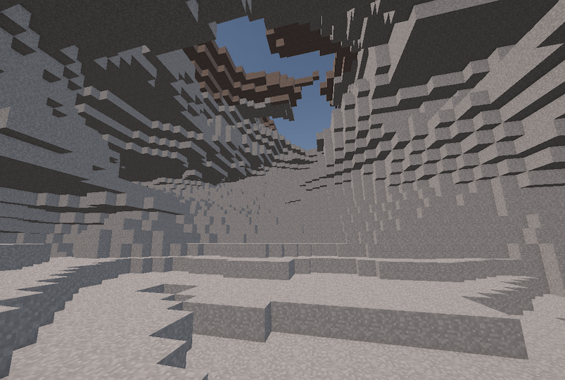

Hello, I'm Ville Lindblad. I'm an experienced programmer capable of solving problems and building games.
I have several years of professional experience using the **Unity** engine and **C#**.
Other tech I have experience with includes **Git**, **Python**, **Bash**, **Java**, **C++**, **JavaScript**, **HTML** and **CSS**.
I'm also a fast learner of new technologies.

I strive for simple, easy to understand and maintainable code.
I make sure the projects I work on stay organized and follow best practices.
I try to reduce technical debt when I can.
I like helping others to solve issues, avoid blockers and improve workflows.

Some things I have worked on (Check the projects for more!):
- Gameplay features and tech
- UI features and tech
- Integrating SDK's, backend services and analytics to mobile apps
- Automation, tools and build scripts to speed up development
- CI/CD pipelines, setting up self hosted mac and windows runners
- Publishing apps to Google Play and App Store and making them pass the review
- Authoring technical design documents and onboarding guides
- Mentoring juniors and conducting code reviews
- Optimization (profiling, memory usage, build size, eliminating GC allocations, overdraw, draw calls)

My professional experience is in mobile games but I have interest in developing also for PC or console.
I also have some interest in graphics programming, having done some shaders, procedural terrain, textures and mesh generation.

- [LinkedIn](https://www.linkedin.com/in/ville-lindblad/)
- [GitHub](https://github.com/villevli)

### Here's some projects I have worked on:

- [Playstack](#playstack)
  - [Snatch/Dibs 🗺️](#snatchdibs-️)
  - [Glass Art 🎨](#glass-art-)
  - [Taxi Dash 🚖](#taxi-dash-)
  - [Mirror for firebase packages in Unity](#mirror-for-firebase-packages-in-unity)
- [Metropolia Game Studio](#metropolia-game-studio)
  - [Soludus ☀️](#soludus-️)
  - [Capitalistica 💰](#capitalistica-)
  - [Siimes 🌳](#siimes-)
- [Metropolia UAS](#metropolia-uas)
  - [Procedural voxel terrain ⛰️](#procedural-voxel-terrain-️)
  - [2d physics engine in JavaScript 🏀](#2d-physics-engine-in-javascript-)
  - [Chess AI in C++ ♟️](#chess-ai-in-c-️)
  - [Intro to OpenGL API in C++ 🐇](#intro-to-opengl-api-in-c-)
  - [Embedded ventilation fan controller in C++ 🔌](#embedded-ventilation-fan-controller-in-c-)
  - [Arkanoid 2016 🎮](#arkanoid-2016-)
  - [Nox Daemonica 🕸️](#nox-daemonica-️)
  - [Fleet Commander 🚀](#fleet-commander-)
  - [Space Incident 🌌](#space-incident-)
- [Hobby projects](#hobby-projects)
  - [Cubes (inspired by Minecraft) ⛰️](#cubes-inspired-by-minecraft-️)
  - [Procedural planet 🌍](#procedural-planet-)
  - [Defender arcade game prototype 👾](#defender-arcade-game-prototype-)
  - [Procedural voxel terrain with LOD ⛰️](#procedural-voxel-terrain-with-lod-️)
  - [Post Effect Mask](#post-effect-mask)
  - [Portal mechanics](#portal-mechanics)

# Playstack

I have worked several years at Playstack as a programmer implementing the full range of client side features and tech for mobile games.

## Snatch/Dibs 🗺️

Gamified engagement with brands in a location-based live-service game.
- Unity
- iOS
- Android

What I worked on:

### Collaboration
- Worked in a team of 14 people using agile software development practises and git as version control software
- Collaborated with designers, artists, programmers and QA
- Authored a "getting started" guide for developers, development process guidelines and coding conventions document
- Created technical design documents for various features
- Was praised for clear and comprehensive Confluence documents and Jira tickets
- Did code reviews and mentored a junior to improve code quality and avoid bugs
- Worked as the technical "consultant" in the team. Helped to solve issues and gave guidance about the project, Unity, C# and other tech

### Features
- Making a player character walk smoothly on a floating origin tile based world map (Mapbox SDK) based on GPS location
- Player character customizer. Clothes/wearables are defined using prefabs and scriptable objects and can be delivered via assetbundles
- Social login using Firebase Auth, Sign in with Google, Apple and Facebook
- Snatching. Players can steal boxes form other players via a minigame. Semi-realtime where players can use items and its effects will affect the other player
- Gifting. Players can gift items to friends or invite new players by sharing links. Implemented UI and client side logic. Designed the backend API and database model together with a backend developer. Had a feature flag
- Seasonal events. Customize map colors, props, UI colors, etc. Config and assets can be delivered via assetbundles
- Text localization. Texts defined in a csv file that can be also be hotfixed without a new build
- UI stack system that supports loading canvases via additively loaded scenes when needed
- Loading of png and jpg images from the web. Optimized loading, rescaling to optimize for the size on screen, pooling of textures and automatically loading and unloading when a surface or UI element becomes visible

### Networking
- Client side code and GraphQL queries for our backend API
- HTTP request pipeline system in client with middleware methods to easily add logging, retrying, etc.
- Wrapper interface for the backend API to easily swap the implementation to a mockup version in client for testing offline locally

### Backend
- Implemented a GraphQL server in python using Tornado and Graphene
- Worked on implementing JWT authentication
- Performed queries for maintenance in MongoDB web dashboard and using MongoDB Shell (mongosh)
- Created Bash and JavaScript scripts for importing csv files and syncing some MongoDB collections between dev, staging and prod environment
- Configured various 3rd party services integrated into the game like Firebase, Google OAuth, OneSignal

### Tools
- Runtime debug menu to view logs and adjust game settings on device. Used extensively by QA and to share logs
- Improved iteration time by making the game playable without domain reload by fixing static initializations
- Quick scene selector in Unity's toolbar to improve the workflow in a project built with multiple additively loaded scenes
- Quick server (dev, stage, prod) and user (Firebase auth) selector in Unity's toolbar
- Game view object picker for debugging (Included in my [UnityEditorExtensions](https://github.com/villevli/UnityEditorExtensions) package)
- Runtime logcat viewer using Java code to stream the logcat to a file and browse them e.g after a crash
- Asset reference search tool. Displays reference counts in the project window. Used multiple times to verify if some asset is safe to remove
- Created data sheets using Google Sheets and Apps Script for managing the localized texts and player character customization options

### Tech
- Refactored legacy code to make code more understandable and maintainable
- Event system to make different game systems less coupled and an easy way to globally listen for events and state changes particularly in UI code
- A way to easily reference assets to be loaded from assetbundles (simpler compared to Unity’s addressables) by serializing the guid in editor and converting it to assetbundle name and assetpath at build time. Also allows to create a weak reference in editor to avoid loading the referenced asset to memory before it's needed

### CI/CD
- Built a GitLab CI/CD pipeline to run tests, build and upload assetbundles and the app for Android and iOS from self hosted Mac Mini and Windows machines
- Bash script to install project Unity versions and other build and deployment tools automatically
- Bash script to cache the Unity Library folder separately per each Unity version. Moving the folder instead of the slow zip and unzip that GitLab CI's own cache does
- Installed build tools like Xcode, Firebase CLI, AWS CLI
- Solved various hard to diagnose errors after updating various SDKs or the build tools like Unity and Xcode
- Python script to filter the log output of the Unity build process
- Python script to generate release notes for each build from the git history

### Publishing
- Set up signing certificates and provisioning profiles for publishing to App Store
- Made changes to app and updated build tools to comply with Google Play and App Store requirements
- Helped configure store pages and app information to pass reviews by Google and Apple

### SDK integrations
- These integrations included adding to the Unity project and configuring in the web dashboard of each service
- Firebase Auth, Crashlytics and Analytics
- Google sign in plugin
- Implemented Sign in with Apple using Objective-C code to expose the API to Unity. Did not find a ready made solution at the time
- Push notifications using OneSignal
- Deeplinking using Branch.io

### Analytics
- Implemented a wrapper for analytics events API to easily switch the underlying service
- Designed the analytics events sent by the client based on requirements
- Wrote some SQL queries for checking the analytics data

### Optimization
- Optimized code and assets to improve performance and battery life
- Fixed methods using too much CPU or GC allocations per frame with help of the Unity profiler
- Reduced overdraw and draw calls with help of the frame debugger
- Reduced memory usage and app size by finding unused assets and optimizing sprite sizes and atlases with help of Unity's build report and a custom project scanning tool to find where assets are used
- Optimized UI components like UIParticleSystem to reduce UI canvas rebuilds and layout updates

 

## Glass Art 🎨

Artful hyper casual game where you can build stained glass artworks by cutting and combining pieces.
- Unity
- Android
- iOS

What I worked on:
- Algorithm for cutting a 2d mesh / polygon by drawing a line and generating the mesh from the list of edge points
- Firebase Storage and Dynamic Links to share the artworks you create
- Optimized sprites and guided the artist

 

## Taxi Dash 🚖

Infinite runner where you drive a taxi, pick up and drop off passengers and plow through obstacles.
- Unity
- Android
- iOS

What I worked on:
- Floating origin (camera stays still, world moves) to enable infinite run without floating point issues
- "Air resistance" custom physics logic to make physics look correct
- Online leaderboard using Firebase Realtime Database

 

## Mirror for firebase packages in Unity

[google-unity-packages-mirror · GitLab](https://gitlab.com/google-unity-packages-mirror)

- Built to avoid having to commit the large firebase core package into a project and instead download it from a git repository via the Unity package manager
- Runs a scheduled CI/CD pipeline every night to download the .tgz unity packages published by google and pushes them to gitlab giving each version a tag so it can be used in the Unity package manager

 

# Metropolia Game Studio

At Metropolia Game Studio I worked on serious and educational games as customer projects.

## Soludus ☀️

Virtual reality game teaching about the use of renewable energy.
- Unity
- SteamVR
- Source code: [Soludus/Soludus2Enercity](https://github.com/Soludus/Soludus2Enercity)

What I worked on:
- VR game controls using the SteamVR plugin
- Drag to move around game map using controls similar to Google Earth VR
- Day night cycle that continually adjusts light settings using curves and gradients
- Integrated FMOD sounds into the game logic

 

## Capitalistica 💰

Mobile game teaching maths and financial management.
- Unity
- Android

 

## Siimes 🌳

Social game for use in elementary schools. Works in browsers using WebGL.
- Unity
- WebGL

 

# Metropolia UAS

When studying at Metropolia University of Applied Sciences I worked on these projects:

## Procedural voxel terrain ⛰️

- Bachelor's thesis
- A tech demo with procedural generation of terrain and chunk based meshing to create an "infinite" world
- Multiple layers of perlin noise to create a signed distance field resembling mountains
- Marching cubes for generating a mesh from the signed distance field
- Multithreaded chunk loading and generation
- Realtime terrain modification using boolean operations on the distance field

 

## 2d physics engine in JavaScript 🏀

Try it here: [Physics2D](https://villevli.github.io/physics2d-js/)

- Physics simulation that calculates collisions and forces between polygons
- Uses no libraries, only the canvas api and JavaScript in browsers
- Source code: [villevli/physics2d-js](https://github.com/villevli/physics2d-js)

## Chess AI in C++ ♟️

- Pair programming for an AI chess competition
- Alpha-beta algorithm
- Optimizations like storing the 8x8 chessboard states in 64 bit integer bitmasks
- Our program won the competition 🏆

## Intro to OpenGL API in C++ 🐇

- Drawing a mesh with a texture and shader using the OpenGL API

## Embedded ventilation fan controller in C++ 🔌

- Control the speed of a ventilation fan
- Fan is connected to an ABB frequency converter
- Converter is controlled using Modbus protocol
- Two operating modes: Manual and Automatic
- LCD user interface
- Arduino, LPCXpresso, UART, I2C

## Arkanoid 2016 🎮

- A clone of the retro game Breakout/Arkanoid in the Unity game engine
- Works on mobile and PC
- Includes a level editor and leaderboard

## Nox Daemonica 🕸️

- A small 1-4 player LAN co-op action RPG dungeon
- Implemented using the Photon Unity networking library

## Fleet Commander 🚀

- A space battle simulator where you build your fleet and watch a simulated battle in 3d space
- Ships have "AI" steering and attack routines

 

## Space Incident 🌌

- A point and click graphic adventure game where you solve a mystery in a space station
- Includes procedurally generated corridors

 

 

# Hobby projects

## Cubes (inspired by Minecraft) ⛰️

- Procedural terrain made from blocks. Includes noise caves under ground
- Generated in 16x16x16 chunks
- Hidden surfaces are culled to make rendering very fast even with larger view distances
- Using the burst compiler for all heavy calculations to make it many times faster
- Using background threads to make traversal in the world smooth even when loading or generating chunks
- Procedural generation with perlin noises is done in a GPU compute shader. 4096 chunks (16.7 million blocks) generates in under 20 milliseconds on RTX 3070
- Source code: [villevli/cubes-unity](https://github.com/villevli/cubes-unity)

 

## Procedural planet 🌍

- Shader graph
- 3d fractal perlin noise on GPU

 

## Defender arcade game prototype 👾

- Simple clone of the retro game Defender in Unity
- Seamlessly looping game area
- Parallax background
- Minimap
- Keyboard, mouse, gamepad and touch controls using the new Input System
- Source code: [villevli/vl-defender-arcade](https://github.com/villevli/vl-defender-arcade)

## Procedural voxel terrain with LOD ⛰️

- 3d fractal noise
- Marching cubes meshing
- Chunk loading to create "infinite" world
- Octree loading for level of detail based on distance to camera

## Post Effect Mask

[Applying image effects to specific objects - Unity discussions](https://discussions.unity.com/t/applying-image-effects-to-specific-objects/666124/12)

- Mask any camera post effects. Use e.g. to apply a post effect only to defined objects
- Draws an alpha mask and uses alpha blending to blend the processed image on top of the unprocessed image

## Portal mechanics

- Created a seamless portal between any 2 points in the 3d world (like in the game Portal)
- Used cameras, shaders, render texture and stencil buffer
- Teleports any objects passing through and keeping the relative orientation and velocity
