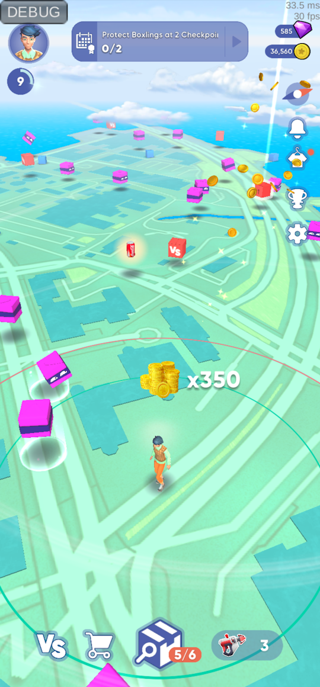
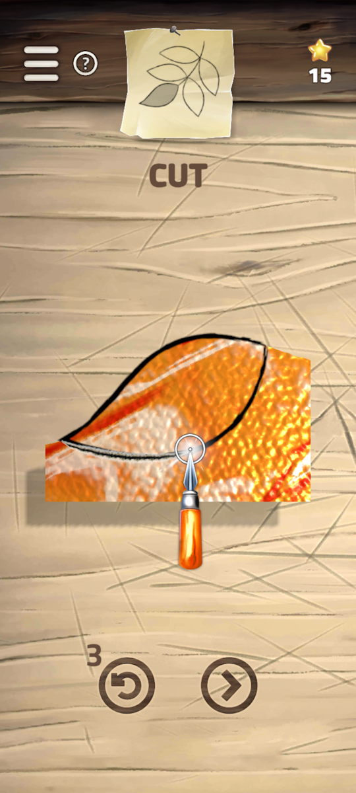
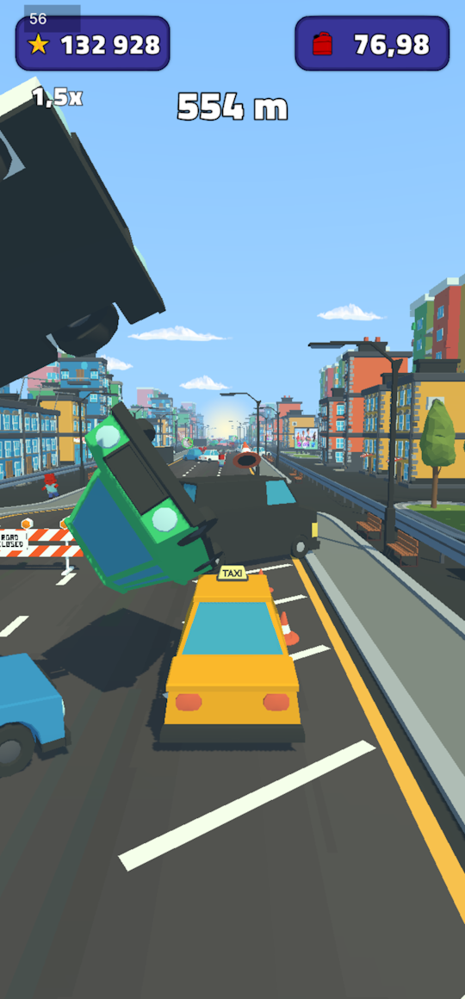
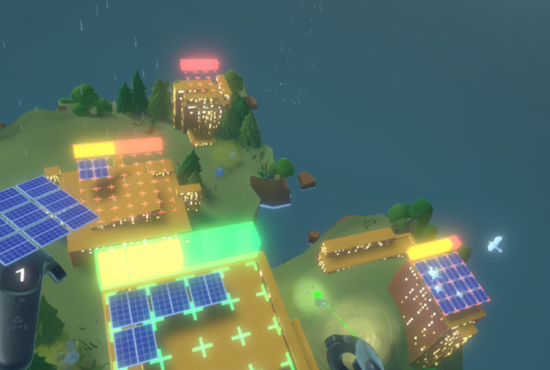
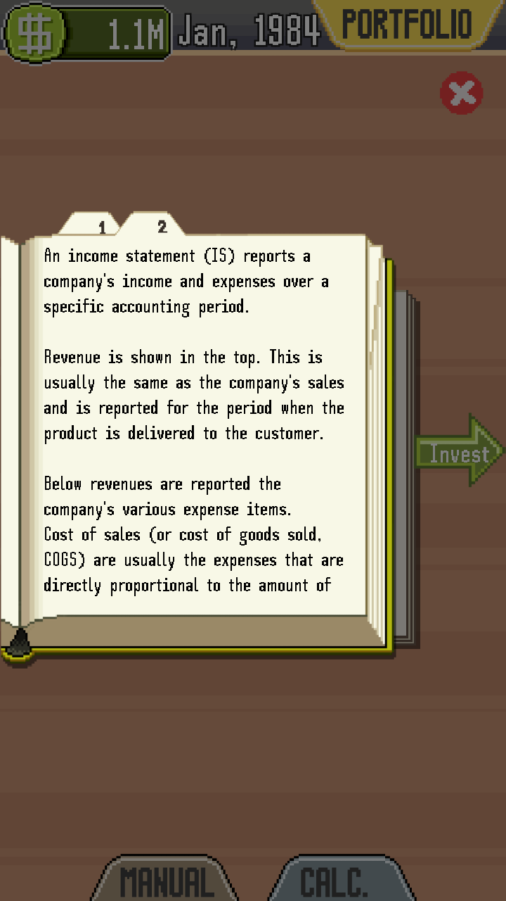
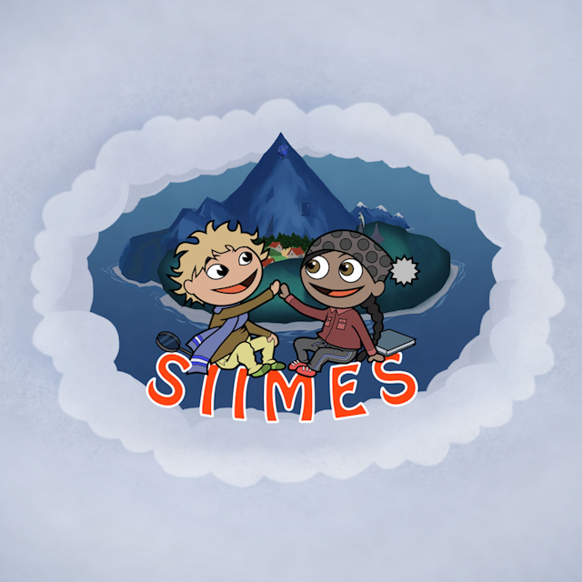
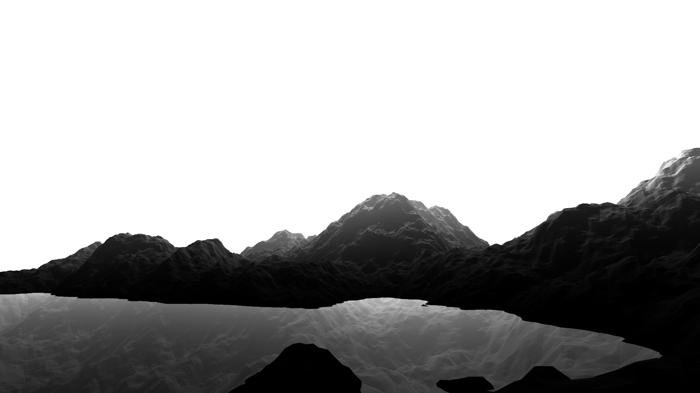
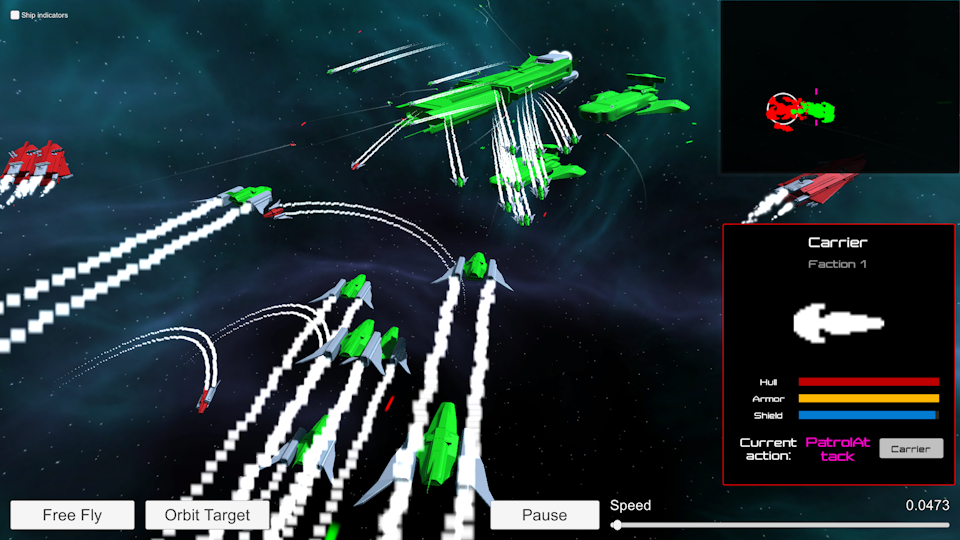
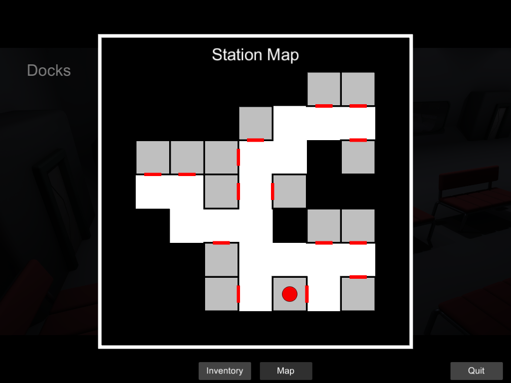
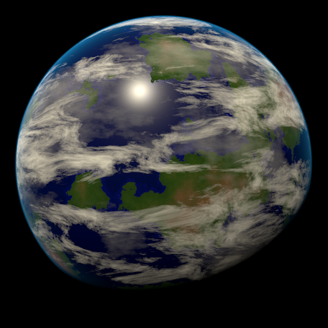

Hello, I'm Ville Lindblad. I'm an experienced game programmer with a passion for solving problems and building games.
I have several years of professional experience using the **Unity** engine and **C#**.
Other tech I have experience with includes **Python**, **C++**, **Bash**, **Java**, **JavaScript**, **HTML** and **CSS**.

I care a lot about the performance of games and sometimes spend a lot of time profiling performance, eliminating GC allocations, overdraw, draw calls, etc.
I make sure the projects I work on stay organized and try to reduce technical debt when I can.

I have some interest in graphics programming too, having done some shaders, procedural textures and mesh generation.

I have worked a lot on mobile games but I have interest in developing also for PC.

- [LinkedIn](https://www.linkedin.com/in/ville-lindblad/)
- [GitHub](https://github.com/villevli)

### Here's some projects I have worked on:

- [Playstack](#playstack)
  - [Snatch/Dibs 🗺️](#snatchdibs-️)
  - [Glass Art 🎨](#glass-art-)
  - [Taxi Dash 🚖](#taxi-dash-)
  - [Mirror for firebase packages in Unity](#mirror-for-firebase-packages-in-unity)
- [Metropolia Game Studio](#metropolia-game-studio)
  - [Soludus ☀️](#soludus-️)
  - [Capitalistica 💰](#capitalistica-)
  - [Siimes 🌳](#siimes-)
- [Metropolia UAS](#metropolia-uas)
  - [Procedural voxel terrain ⛰️](#procedural-voxel-terrain-️)
  - [2d physics engine in JavaScript 🏀](#2d-physics-engine-in-javascript-)
  - [Chess AI in C++ ♟️](#chess-ai-in-c-️)
  - [Intro to OpenGL API in C++](#intro-to-opengl-api-in-c)
  - [Arkanoid 2016 🎮](#arkanoid-2016-)
  - [Nox Daemonica 🕸️](#nox-daemonica-️)
  - [Fleet Commander 🚀](#fleet-commander-)
  - [Space Incident 🚀](#space-incident-)
- [Hobby projects](#hobby-projects)
  - [Procedural planet 🌍](#procedural-planet-)
  - [Procedural voxel terrain with LOD ⛰️](#procedural-voxel-terrain-with-lod-️)
  - [Simple Minecraft clone](#simple-minecraft-clone)
  - [Post Effect Mask](#post-effect-mask)
  - [Portal mechanics](#portal-mechanics)

# Playstack

I have worked several years at Playstack as a programmer implementing the full range of client side features and tech for mobile games.

## Snatch/Dibs 🗺️

Gamified engagement with brands in a location based live service mobile game.
- Unity
- iOS
- Android

Notable parts I implemented:

### Features
- Making your character walk smoothly on a floating origin tile based world map (Mapbox SDK) based on GPS location
- Character customizer. Clothes/wearables are defined using prefabs and scriptable objects and can be loaded from assetbundles
- Social login using Firebase Auth, Sign in with Google, Apple and Facebook
- UI stack system that supports loading canvases via additively loaded scenes when needed
- Loading of png and jpg images from the web. Optimized loading, rescaling to optimize for the size on screen, pooling of textures and automatically loading and unloading when a surface or UI element becomes visible

### Optimization
- Optimized code and assets to improve performance and battery life
- Fixed methods using too much CPU or GC allocations per frame with help of the Unity profiler
- Reduced overdraw and draw calls with help of the frame debugger
- Reduced memory usage and app size by finding unused assets and optimizing sprite sizes and atlases with help of Unity's build report and a custom project scanning tool to find where assets are used
- Optimized UI components like UIParticleSystem to reduce UI canvas rebuilds and layout updates

### Tools
- Runtime debug menu to view logs and adjust game settings on device. Used extensively by QA and to share logs
- Quick scene selector to improve iteration speed in a project built with multiple additively loaded scenes
- Improved iteration time by making the game playable without domain reload by fixing static initializations
- Editor scripts and tooling to improve development workflows like quick scene, server and user selector in Unity's toolbar, game view object picker, etc.
- Runtime logcat viewer using Java code to stream the logcat to a file and browse them e.g after a crash
- Asset reference search tool. Displays ref counts in the project window. Used multiple times to remove unused sprites or verify if some asset is safe to remove

### Tech
- Client side code and GraphQL queries for our backend API
- HTTP request pipeline system in client with middleware methods to easily add logging, retrying, etc.
- Wrapper interface for the backend API to easily swap the implementation to a mockup version in client for testing locally
- Refactored legacy code to make code more understandable and maintainable
- Event system to make different game systems less coupled and an easy way to globally listen for events and state changes particularly in UI code
- A way to easily reference assets to be loaded from assetbundles (simpler compared to Unity’s addressables) by serializing the guid in editor and converting it to assetbundle name and assetpath at build time. Also allows to create a weak reference in editor to avoid loading the referenced asset to memory before needed

### CI/CD
- Built a GitLab CI/CD pipeline to run tests, build assetbundles and build the app for Android and iOS from self hosted Mac Mini and Windows machines
- Bash script to install project Unity versions and other build and deployment tools automatically
- Bash script to cache the Unity Library folder separately per each Unity version. Moving the folder instead of the slow zip and unzip that GitLab CI's own cache does
- Installed build tools like Xcode, Firebase CLI, AWS CLI on the Mac Mini
- Solved various hard to diagnose errors after updating various SDKs or the build tools like Unity and Xcode
- Python script to filter the log output of the Unity build process

### SDKs
- Integrated Firebase Auth, Crashlytics and Analytics
- Integrated Google sign in plugin
- Implemented Sign in with Apple using Objective-C code to expose the API to Unity. Did not find a ready made solution at the time
- Integrated OneSignal push notifications

### Analytics
- Implemented a wrapper for analytics events API to easily switch the underlying service
- Designed the analytics events sent by the client based on requirements

### Project
- Wrote a "getting started" guide for developers, process guidelines and coding conventions document
- Did code reviews and mentored a junior to improve code quality and avoid bugs

 

## Glass Art 🎨

Artful hyper casual game where you can build stained glass artworks by cutting and combining pieces.
- Unity
- Android
- iOS

Notable parts I implemented:
- Algorithm for cutting a 2d mesh / polygon by drawing a line and generating the mesh from the list of edge points
- Firebase Storage and Dynamic Links to share the artworks you create
- Optimized sprites and guided the artist

 

## Taxi Dash 🚖

Infinite runner where you drive a taxi, pick up and drop off passengers.
- Unity
- Android
- iOS

Notable parts I implemented:
- Floating origin (camera stays still, world moves) to enable infinite run without floating point issues
- "Air resistance" custom physics logic to make physics look correct
- Online leaderboard using Firebase Realtime Database

 

## Mirror for firebase packages in Unity

[google-unity-packages-mirror · GitLab](https://gitlab.com/google-unity-packages-mirror)

- Built to avoid having to commit the large firebase core package into a project and instead download it from a git repository via the Unity package manager
- Runs a scheduled CI/CD pipeline every night to download the .tgz unity packages published by google and pushes them to gitlab giving each version a tag so it can be used in the Unity package manager

 

# Metropolia Game Studio

At Metropolia Game Studio I worked on serious and educational games as customer projects.

## Soludus ☀️

Virtual reality game teaching about the use of renewable energy.
- Unity
- SteamVR

Notable parts I implemented:
- VR game controls using the SteamVR plugin
- Drag to move around game map using controls similar to Google Earth VR
- Day night cycle that continually adjusts light settings using curves and gradients

 

## Capitalistica 💰

Mobile game teaching maths and financial management.
- Unity
- Android

 

## Siimes 🌳

Social game for use in elementary schools. Works in browsers using WebGL.
- Unity
- WebGL

 

# Metropolia UAS

When studying at Metropolia University of Applied Sciences I worked on these projects:

## Procedural voxel terrain ⛰️

- Bachelor's thesis
- A tech demo with procedural generation of terrain and chunk based meshing to create an "infinite" world
- Multiple layers of perlin noise to create a signed distance field resembling "mountains"
- Marching cubes for generating a mesh from the signed distance field
- Multithreaded chunk loading and generation for "infinite" world
- Realtime terrain modification using boolean operations on the distance field

 

## 2d physics engine in JavaScript 🏀

[Physics2D](https://villevli.github.io/physics2d-js/)

- Calculates collisions and forces between polygons
- Uses no libraries, only the canvas api and JavaScript in browsers
- Source: [villevli/physics2d-js](https://github.com/villevli/physics2d-js)

## Chess AI in C++ ♟️

- Pair programming for an AI chess competition
- Alpha-beta algorithm
- Optimizations like storing the 8x8 chessboard states in 64bit integer bitmasks
- Our program won the competition 🏆

## Intro to OpenGL API in C++

- Drawing a mesh with a texture and shader using the OpenGL API

## Arkanoid 2016 🎮

- A clone of the retro game Breakout/Arkanoid in the Unity game engine
- Works on mobile and PC
- Includes a level editor and leaderboard

## Nox Daemonica 🕸️

- A small 1-4 player LAN co-op action RPG dungeon
- Implemented using the Photon Unity networking library

## Fleet Commander 🚀

- A space battle simulator where you build your fleet and watch a simulated battle in 3d space
- Ships have "AI" steering and attack routines

 

## Space Incident 🚀

- A point and click graphic adventure game where you solve a mystery in a space station
- Includes procedurally generated corridors

 

 

# Hobby projects

## Procedural planet 🌍

- Shader graph
- 3d fractal perlin noise on GPU

 

## Procedural voxel terrain with LOD ⛰️

- 3d fractal noise
- Marching cubes meshing
- Chunk loading to create "infinite" world
- Octree loading for level of detail based on distance to camera

## Simple Minecraft clone

- Experimenting with optimized minecraft style cube rendering with a generated mesh per chunk and hidden surface removal in an "infinite" chunked world

## Post Effect Mask

[Applying image effects to specific objects - Unity discussions](https://discussions.unity.com/t/applying-image-effects-to-specific-objects/666124/12)

- Mask any camera post effects. Use e.g. to apply a post effect only to defined objects
- Draws an alpha mask and uses alpha blending to blend the processed image on top of the unprocessed image

## Portal mechanics

- Used camera and shader tricks, render texture and stencil buffer to create a portal between any 2 points in the 3d world
- Code to teleport any objects passing through and keeping the relative orientation and velocity
